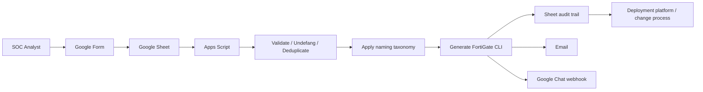

# FortiGate IoC Automation Hub

> A lightweight CyberOps workflow that turns structured IoC requests into standardized FortiGate CLI, records the request, emails the generated configuration, and notifies a Google Chat space.

## Why this project exists

IoC blocking is a simple task, but manual CLI generation creates unnecessary operational risk: inconsistent object names, syntax mistakes, incomplete changes, accidental blocking of critical services, and poor traceability.

This project moves those deterministic decisions into code. The analyst decides **what should be blocked**; the workflow decides **how the FortiGate objects and groups are built**.

### Core outcomes

- Standardized naming and object/group construction.
- Automatic undefanging and classification of IPv4/CIDR and FQDN indicators.
- Deduplication of repeated indicators.
- Safety allowlist for critical public DNS and protected domains.
- Deterministic FortiGate CLI generation.
- Google Chat notification through an incoming webhook.
- Email distribution of the generated CLI.
- Request and CLI traceability in Google Sheets.
- Dynamic notification-recipient management from the spreadsheet UI.

## Workflow



The deployment mechanism is intentionally kept outside this repository. In the original operational use case, the generated CLI is handed to an existing centralized deployment workflow.

## Example

Input:

```text
Ticket: INC-12345
Change: CHG-67890
FQDNs:
malicious-example[.]invalid
hxxps://c2-demo[.]invalid/login

IPs:
198.51.100.25
203.0.113.0/28
1.1.1.1
```

The workflow undefangs and deduplicates the indicators, omits `1.1.1.1` because it is protected, and generates CLI similar to:

```fortios
config firewall address
    edit "IOC_c2_demo_invalid"
        set type fqdn
        set fqdn "c2-demo.invalid"
        set comment "Block request INC-12345"
    next
    edit "IOC_malicious_example_invalid"
        set type fqdn
        set fqdn "malicious-example.invalid"
        set comment "Block request INC-12345"
    next
    edit "IOC_198_51_100_25"
        set comment "Block request INC-12345"
        set subnet 198.51.100.25 255.255.255.255
    next
end
```

A complete safe example is available in [`examples/sample-output.conf`](examples/sample-output.conf).

## Components

| Component | Responsibility |
|---|---|
| Google Forms | Structured analyst input |
| Google Sheets | Request storage, generated CLI and notification configuration |
| Apps Script | Validation, normalization, taxonomy, CLI generation and routing |
| Google Chat webhook | Team visibility |
| MailApp | CLI delivery to configured recipients |
| FortiGate | Target syntax/platform |

Apps Script acts as a small **integration/orchestration middleware layer** between the analyst workflow and downstream notification/deployment systems.

## Security controls in the public reference implementation

The public version intentionally improves several controls over a quick internal prototype:

- The Google Chat webhook is stored in **Apps Script Script Properties**, never hard-coded.
- User-controlled fields are sanitized before being inserted into FortiGate CLI strings.
- IPv4/CIDR values are validated before CLI generation.
- Protected IPs/domains are filtered before generation.
- Demo indicators use documentation-only address ranges and `.invalid` domains.

> **Important:** this repository generates configuration text. It does not automatically connect to or modify a firewall. Review generated CLI through your organization's normal change-control process before deployment.

## Setup

See [`docs/setup.md`](docs/setup.md) for the complete installation guide.

At a high level:

1. Create the Google Form and link it to a Sheet.
2. Open **Extensions → Apps Script** from the response Sheet.
3. Copy `src/Code.gs` and `src/appsscript.json`.
4. Create the installable **On form submit** trigger for `onFormSubmit`.
5. Add `GOOGLE_CHAT_WEBHOOK_URL` to Apps Script **Script Properties**.
6. Configure notification recipients from the custom spreadsheet menu.
7. Submit a test request using safe test indicators.

## Repository structure

```text
.
├── README.md
├── SECURITY.md
├── src/
│   ├── Code.gs
│   └── appsscript.json
├── docs/
│   ├── architecture.md
│   └── setup.md
└── examples/
    ├── sample-input.txt
    └── sample-output.conf
```

## Roadmap

The current version intentionally focuses on **request → standardized CLI → notification**. Natural next steps include:

- FortiGate Automation Stitch callbacks to confirm configuration changes.
- Intent-vs-state validation across multiple firewalls.
- Change-risk scoring for policy modifications.
- Sentinel / SIEM correlation.
- Centralized event normalization and a broader CyberOps notification hub.

## Disclaimer

This is an independent community project and is not affiliated with or endorsed by Fortinet or Google. Test in a lab and adapt the controls, naming conventions, allowlists, and change process to your environment before production use.
