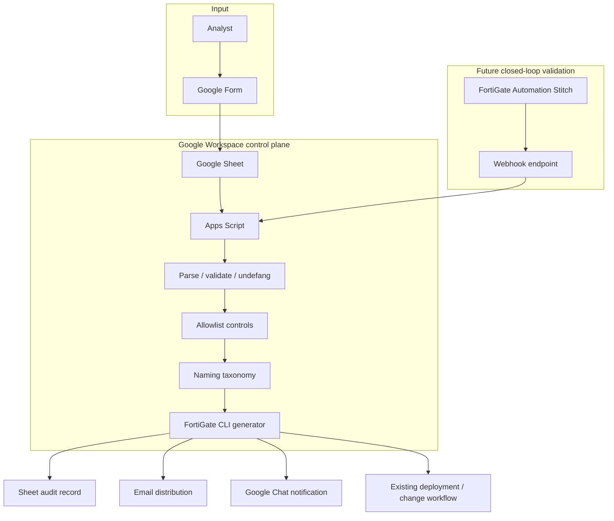

# Architecture

## Design principle

The analyst owns the **security decision**; the automation owns the **deterministic implementation details**.

## Why Apps Script is the middleware

Apps Script receives structured data from the form/sheet and performs four middleware functions:

1. **Transformation** — defanged/raw indicators become normalized data and FortiGate CLI.
2. **Policy enforcement** — naming conventions, validation and allowlist rules are applied consistently.
3. **Routing** — the same event is routed to the Sheet, email and Google Chat.
4. **Orchestration** — the workflow is executed in a controlled order from request to generated output.

For a moderate internal workflow this keeps the solution small and maintainable. If event volume or integration complexity grows substantially, the same logical layers can be moved to an event-driven platform such as Cloud Run/Functions plus a queue or event bus.

## Trust boundaries

The repository does **not** include direct firewall credentials or firewall API access. The output is CLI text that should pass through the organization's normal review and deployment controls.

The Google Chat webhook is a secret and must remain outside source control.
